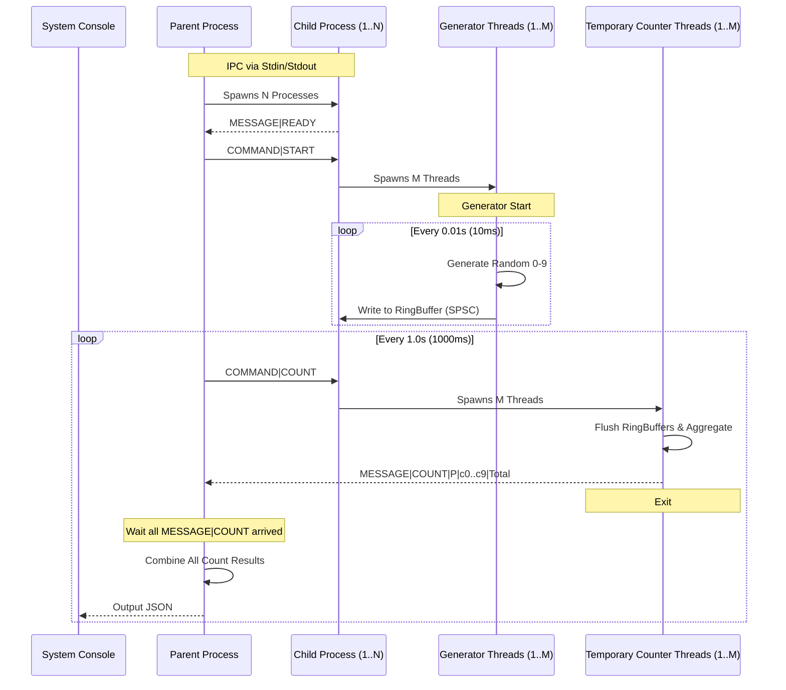

# Multi-Process Integer Counter
The system employs a Parent-Child process model to ensure memory isolation and scalability. \
Communication is handled via Standard I/O (IPC) using a custom compact protocol.
- Javaを使い、Collection系ライブラリーはスレッドセーフでないものしか使わない
- N + 1個のプロセス　と　M × N個のスレッド　の整数カウンタープログラム作りました
- スレッド間共用のObjectの排他制御は自作です
- IPCのやり方として、`COMMAND`と`MESSAGE`を定義して、各プロセスのstdioで実現しました
- IPCはSocketを使ってもいいですが、MとNの上限分からないの環境なら、IPとport決めれないので、stdio採用しました

## Architecture & Design

### Framework Diagram


## Usage
### Prerequisites
- Java: OpenJDK 17
- (Option) Maven: 3.9.x

### Running the Program
The program requires two arguments: N (number of processes) and M (number of threads per process).

1. Standard Output (Release Mode) Outputs the required JSON format.
```bash
# Using maven
mvn -Prelease exec:java -Dexec.args="N M"

# Using Java
mkdir bin
javac -encoding UTF-8 -d bin src/main/java/dev/yin/lib/*.java src/main/java/dev/yin/process/*.java src/main/java/dev/yin/App.java
java -cp bin dev.yin.App N M
```

2. Detailed Output (Debug Mode) Outputs JSON including the total count for easier verification.
```bash
# Using maven
mvn -Pdebug exec:java -Dexec.args="N M"

# Using Java
mkdir bin
javac -encoding UTF-8 -d bin src/main/java/dev/yin/lib/*.java src/main/java/dev/yin/process/*.java src/main/java/dev/yin/App.java
java -Ddebug.mode=true -cp bin dev.yin.App N M # Notice: this command cannot work on Windows powershell
```


### Example Output
1. Standard Output
```
Hello World! From ParentProcess
{ "time": "1768752872","counts": {"0": 38, "1": 64, "2": 50, "3": 49, "4": 53, "5": 49, "6": 62, "7": 56, "8": 41, "9": 43} }
{ "time": "1768752873","counts": {"0": 121, "1": 139, "2": 120, "3": 154, "4": 141, "5": 159, "6": 142, "7": 146, "8": 142, "9": 142} }
{ "time": "1768752874","counts": {"0": 126, "1": 148, "2": 146, "3": 117, "4": 135, "5": 149, "6": 137, "7": 137, "8": 139, "9": 152} }
...
```

2. Detailed Output
```
Hello World! From ParentProcess
expectedTotal of each counter JSON output string: 1500
{ "time": "1768752831","counts": {"0": 58, "1": 58, "2": 58, "3": 49, "4": 45, "5": 47, "6": 49, "7": 44, "8": 49, "9": 43}, "total": 500 }
{ "time": "1768752832","counts": {"0": 151, "1": 156, "2": 141, "3": 146, "4": 153, "5": 157, "6": 146, "7": 144, "8": 145, "9": 161}, "total": 1500 }
{ "time": "1768752833","counts": {"0": 150, "1": 125, "2": 148, "3": 167, "4": 106, "5": 145, "6": 136, "7": 127, "8": 152, "9": 140}, "total": 1396 }
...
```

## Project Structure
- `dev.yin.lib`: Core data structures (`RingBuffer` , `FlushQueue` , `AtomicInteger` ) and IPC message definitions.
- `dev.yin.process`: Logic for the `ParentProcess` and `ChildProcess`
- `dev.yin.App`: Entry point.